**RESUME SDLC (SOFTWARE DEVELOPMENT LIFE CYCLE)**

LATAR BELAKANG

Pada awal-awal pengermbangan perangkat lunak, programmer zaman dahulu
langsung mengimplementasi kode mereka tanpa menggunakan prosedur atau
tahapan pengembangan software. Seiring dengan bertambahnya besar proyek
dan tim, mereka mulai menemukan masalah-masalah seperti kesulitan saat
maintenance program, pengelolaan waktu dan biaya yang tidak efektif, dan
kurangnya standar dalam pengembangan software. Untuk mengatasi hal ini
maka dibutuhkan suatu tahapan kerja yang bertujuan untuk menghasilkan
sistem berkualitas tinggi yang sesuai dengan kebutuhan pelanggan, dalam
hal waktu, efektivitas, dan efisiensi.

PENGERTIAN

SDLC adalah suatu tahapan kerja yang berulang atau siklus yang digunakan
dalam pembuatan atau pengembangan sistem informasi yang bertujuan untuk
menyelesaikan masalah secara efektif. SDLC menjadi sebuah framework /
kerangka kerja yang berisi langkah-langkah yang harus dilakukan untuk
pengembangan software. Sistem ini berisikan rencana lengkap untuk
develop, maintain, dan replace aplikasi. Fungsi utama dari SDLC ini
adalah untuk membantu perancangan software. Fungsi lainnya, SDLC juga
berfungsi untuk membagi tugas dan tanggung jawab yang jelas di antara
pengembang, desainer, analis bisnis, dan manajer proyek. Selain itu,
SDLC memberikan gambaran yang jelas mengenai input dan output dari satu
tahap ke tahap berikutnya.

TAHAPAN / FASE-FASE DALAM SDLC

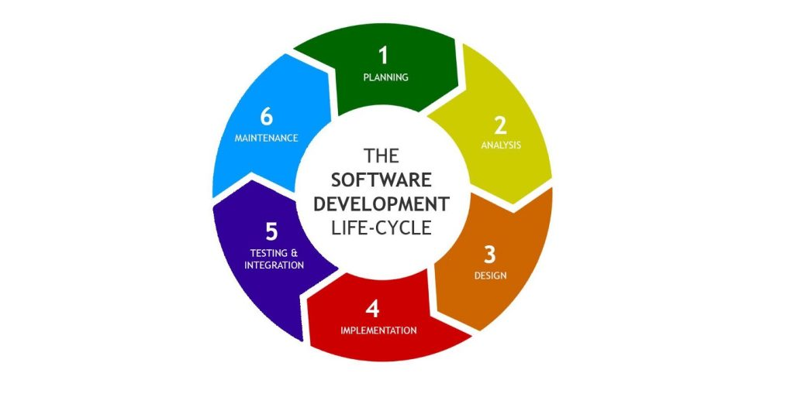

1\. Planning:

- Bertujuan untuk menentukan tujuan dari proyek dan merencanakan
  bagaimana proyek tersebut dapat dilaksanakan.

- Pada fase ini, tim dibentuk dan mendefinisikan tujuan dan scope dari
  development. Kemudian menentukan strategi yang akan digunakan dalam
  development sistem. Terakhir, melakukan pemilihan teknologi yang
  digunakan selama proses development.

2\. Analysis

- Bertujuan untuk memahami kebutuhan pengguna. Di fase ini, tim akan
  menganalisis bagaimana sistem akan dijalankan nantinya, kemudian
  melakukan perencanaan proyek yang meliputi alokasi sumber daya,
  penjadwalan proyek, dan estimasi biaya.

- Pada fase ini, tim melakukan studi literatur untuk mengetahui sebuah
  permasalahan yang dapat diselesaikan atau dimodelkan dengan sistem.
  Kemudian brainstorming dalam tim untuk menentukan case mana yang
  paling tepat untuk dimodelkan. Setelah case ditemukan, tim akan
  mengklasifikasi masalah, peluang, dan solusi yang bisa diterapkan
  untuk case tersebut. Lalu, membuat batasan-batasan dalam pengembangan
  sistem serta melakukan analisa kebutuhan sistem. Terakhir, menyusun
  skenario penggunaan sistem atau Use Case.

- Studi literatur penngumpulan kebutuhan pengguna dapat dilakukan dengan
  wawancara, survei, atau metode lainnya.

3\. Design

- Fase ini merupakan fase di mana seluruh hasil analisis dan pembahasan
  mengenai spesifikasi sistem diterapkan menjadi sebuah blueprint.
  Output dari fase ini adalah desain prototype sistem yang di setiap
  User Interface-nya sudah saling berinteraksi. Untuk diagram alur juga
  dibuat pada fase ini.

- Selain User Interface dan interaksi objek beserta fungsinya dalam
  sistem, skema database juga dianalisa dan di-design. Karena pada fase
  ini, sistem akan segera diimplementasikan dalam bentuk kode.

4\. Implementation/Development

- Mengimplementasikan seluruh rancangan dan desain dari tahap-tahap
  sebelumnya ke dalam kode yang berfungsi sesuai dengan spesifikasi
  design, baik yang Front End, Back End, Database, dsb.

- Komponen-komponen dan modul digabung menjadi satu sistem yang
  berfungsi.

- Outputnya yaitu source code yang disimpan di version control seperti
  GitHub, GitLab

5\. Testing

- Memastikan bahwa sistem bekerja sesuai spesifikasi dan bebas dari bug

- Terdapat beberapa testing yang akan dilakukan, yaitu:

  - Unit Testing

  - Integration Testing

  - System Testing

  - Acceptance Testing

- Kemudian melakukan debugging pada sistem yang bug.

- Outputnya yaitu laporan hasil pengujian, kemudian laporan sistem yang
  telah diperbaiki.

6\. Integration

- Memindahkan env ke production dan melakukan deployment.

- Melakukan pelatihan ke user mengenai cara penggunaan sistem.

7\. Maintenance

- Memastikan sistem tetap mampu beroperasi dengan benar dan
  mengadaptasikan diri sesuai dengan kebutuhan.

- Memperbaiki bug yang ditemukan oleh user

- Melakukan update pada sistem secara berkala untuk penambahan fitur
  baru dan peningkatan reliabilitas dan stabilitas sistem.

- Monitoring kinerja sistem untuk mendeteksi dan mengetahui adanya
  masalah.

**MACAM MACAM SDLC**

1\. Linear Sequential Model / Waterfall

\- Metode pengembangan dengan pendekatan sekuensial yang memiliki nama
lain “Classic Life Cycle”

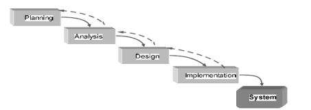

Terdiri dari:

- Rekayasa Sistem dan Analisis.

- Analisis Kebutuhan Perangkat Lunak

- Perancangan

- Pembuatan Kode

- Pengujian

- Pemeliharaan

  - Corrective Maintenance

  - Adaptive Maintenance

  - Perfektive Maintenance

2\. Parallel Model

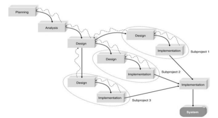

Model Paralel adalah metodologi yang mengatasi jeda panjang antara
analisis dan delivery sistem dengan membagi proyek menjadi subproyek
yang dapat dikerjakan secara paralel. Ini memperbaiki kelemahan model
waterfall dengan melakukan desain umum dan implementasi berurutan, lalu
mengintegrasikan subproyek kedalam sistem untuk segera dideliver.

3\. Iterative Model

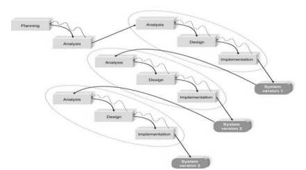

Iterative Model dikembangkan untuk mengatasi kekurangan model waterfall
dengan memberikan hasil lebih cepat, membutuhkan informasi yang lebih
sedikit, dan menawarkan fleksibilitas lebih besar. Model ini membangun
perangkat lunak secara bertahap dengan memperluas model dasar yang telah
disesuaikan berdasarkan feedback. Setiap iterasi adalah proses
mini-Waterfall yang menghasilkan produk perangkat lunak yang dapat
langsung diproduksi.

4\.

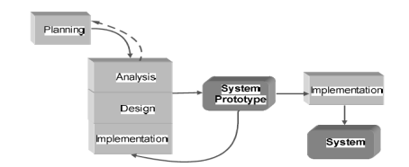

Prototyping approach digunakan ketika pengguna hanya memberikan tujuan
umum software tanpa detail spesifik, dan pengembang belum yakin akan
efisiensi algoritma atau antarmuka. Aktivitasnya meliputi:
mendefinisikan tujuan keseluruhan, merancang prototype, serta menguji
dan memperbaiki prototype berdasarkan evaluasi.

5\. Threwaway Prototyping Model

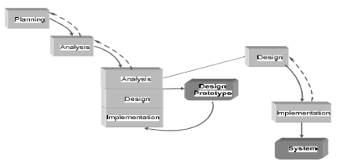

Metodologi ini mirip dengan prototyping. Fokusnya adalah menguji fitur
yang tidak dipahami dengan membuat dan menguji prototype desain.
Prototype ini cukup rinci untuk membantu pengguna memahami isu-isu yang
dipertimbangkan. Setelah masalah solved, desain prototype dibuang,
berbeda dengan prototyping di mana prototype berkembang menjadi sistem
final. Pendekatan ini menghasilkan sistem yang lebih stabil dan andal.

6\. RAD (Rapid Application Development) Model

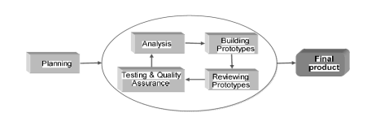

Model Rapid Application Development (RAD) adalah proses pengembangan
perangkat lunak yang bersifat linear sequential dengan siklus
pengembangan singkat (60-90 hari). Aktivitas RAD mencakup:

a\) Pemodelan Bisnis: Memodelkan aliran informasi di antara fungsi
bisnis untuk menjawab pertanyaan tentang pengendalian, tujuan, dan
pemrosesan informasi.

b\) Pemodelan Data: Menyaring informasi menjadi objek data yang
dibutuhkan untuk menopang bisnis, mengidentifikasi karakteristik dan
hubungan antar objek.

c\) Pemodelan Proses: Mengubah flow informasi dari pemodelan data
menjadi flow yang diperlukan untuk implementasi fungsi bisnis.

d\) Pembuatan Aplikasi: Menggunakan alat bantu otomatis dan komponen
program yang dapat digunakan kembali untuk konstruksi perangkat lunak.

e\) Pengujian dan Pergantian: Mengurangi waktu pengujian dengan
pemakaian kembali komponen yang telah diuji, sementara komponen baru
tetap harus diuji.

Ringkasnya, RAD memungkinkan pengembangan sistem fungsional dalam waktu
singkat melalui pemodelan bisnis, data, proses, pembuatan aplikasi, dan
pengujian yang efisien.

7\. Spiral Model

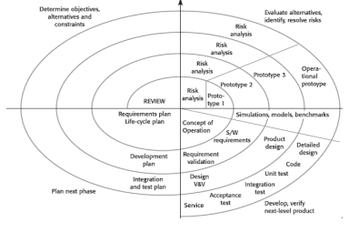

Spiral Model menggabungkan pengulangan dari model prototyping dengan
pengendalian dan sistematika dari model linear sequential, serta
menambahkan analisis risiko. Aktivitas utamanya meliputi:

a\) Perencanaan: Menentukan tujuan, alternatif, dan batasan.

b\) Analisis Risiko: Menganalisis alternatif dan
mengidentifikasi/memecahkan risiko.

c\) Rekayasa: Mengembangkan level berikutnya dari produk.

d\) Evaluasi Pelanggan: Menilai hasil rekayasa.

Dalam model ini, setiap iterasi menunjukkan versi software yang lebih
lengkap. Pada awal siklus, objektif, alternatif, dan batasan
didefinisikan, serta risiko dianalisis. Jika ada ketidakpastian,
prototyping dibuat. Evaluasi pelanggan dilakukan untuk perbaikan. Fase
selanjutnya berdasarkan masukan pelanggan adalah perencanaan dan
analisis risiko. Proyek dapat dihentikan jika risiko terlalu besar.
Model spiral cocok untuk sistem skala besar.

8\. V-Shaped Model

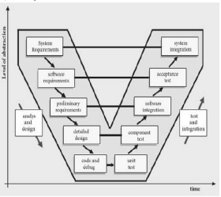

- V-Model mirip dengan waterfall, dengan siklus hidup sekuensial dimana
  setiap fase harus diselesaikan sebelum tahap berikutnya dimulai. Model
  ini menekankan pengujian lebih dari model waterfall, dengan prosedur
  pengujian dikembangkan di awal siklus hidup sebelum coding dilakukan.
  Persyaratan dimulai seperti waterfall, dan rencana uji sistem dibuat
  untuk memastikan pemenuhan fungsi yang ditetapkan.

- Tahap desain tingkat tinggi fokus pada arsitektur sistem dan rencana
  uji integrasi dibuat untuk menguji kemampuan sistem perangkat lunak.
  Pada tahap desain tingkat rendah, komponen software dirancang dan tes
  unit dibuat.

9\. Agile Development

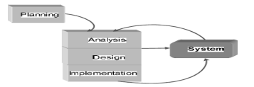

Kategori ini berfokus pada perampingan SDLC dengan mengurangi pemodelan,
dokumentasi overhead, dan waktu yang dihabiskan untuk tugas-tugas.
Proyek menekankan pengembangan aplikasi sederhana dan berulang
menggunakan pemrograman ekstrim (XP). Prinsip utama XP meliputi
pengujian terus-menerus, coding sederhana, dan interaksi dekat dengan
pengguna akhir. Setelah perencanaan, tim proyek melakukan analisis,
desain, dan implementasi iteratif.

**KELEBIHAN DAN KELEMAHAN**

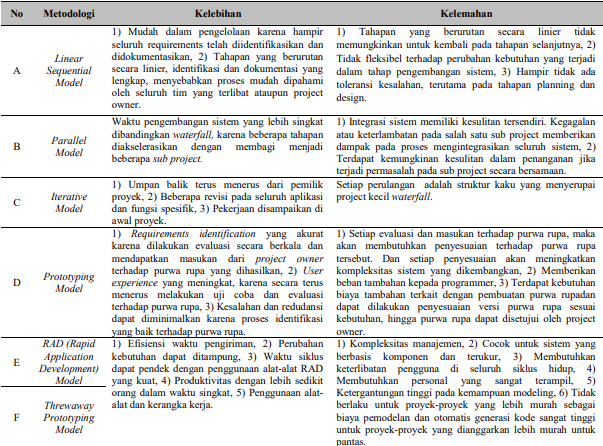

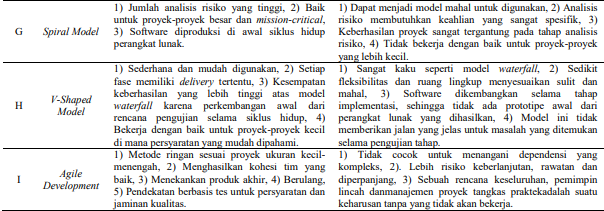

**REFERENSI**

<https://accounting.binus.ac.id/2020/05/19/memahami-system-development-life-cycle/>

<https://ids.ac.id/pengertian-sdlc/>

<https://aws.amazon.com/id/what-is/sdlc/>

Budi, D. S., & Abijono, H. (2016). Analisis pemilihan penerapan proyek
metodologi pengembangan rekayasa perangkat lunak. *Teknika*, *5*(1),
24-31.
