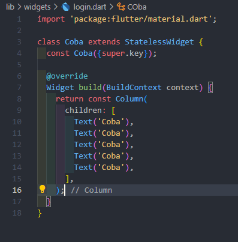
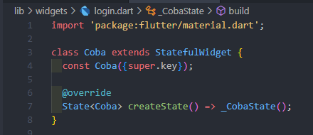
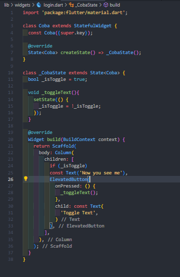
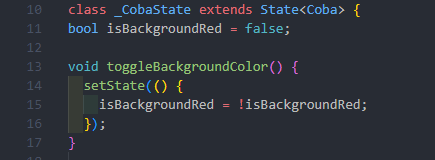
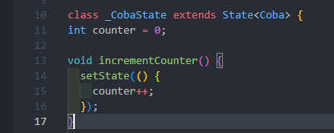

**RESUME TECHSTACK MOBILE DEVELOPER**

**Nama:** Rifqi Rayita Dhiyaulhaq

**1. FLUTTER**

Flutter merupakan sebuah framework yang open-source dari Google yang
menggunakan bahasa dart dan untuk Flutter engine-nya, Skia menggunakan
bahasa C, yang berfungsi untuk men-develop aplikasi multiplatform hanya
dengan satu codebase dan performa yang mendekati native. Flutter
memiliki hot reload yang memungkinkan kita untuk melihat perubahan pada
aplikasi tanpa harus rebuild. Versi Flutter terbaru adalah Flutter 3.
Flutter menerapkan paradigma OOP sehingga kita bisa membuat widget dan
object yang reusable. Flutter terdiri dari widget2 yang membentuk UI
nya. Style dari Flutter ada 2, yaitu Material untuk crossplatform dan
Cupertino untuk iOS-style. Selain kelebihannya yang cross-platform,
reusability component, fast development(hot reload dan hot restart), dan
widgets yang bervariasi baik itu bawaan maupun package, Flutter memiliki
kelemahan seperti size aplikasi yang lebih besar dari native, library
dan plugin yang tidak selengkap native, dan bahasa Dart yang tergolong
‘lebih kecil’ dibanding bahasa-bahasa sekelasnya seperti Java, Swift,
dan Kotlin. Meski begitu, Dart merupakan salah satu bahasa yang
mengalami perkembangan yang signifikan dan komunitas yang *growing*
dengan cepat. Beberapa aplikasi terkenal yang menggunakan Flutter adalah
Google Ads, Alibaba, dan Reflectly.

Dalam Flutter, widget umumnya dibagi menjadi 2 kelas, yaitu Stateless
dan Stateful. Stateless adalah widget yang immutable, yaitu yang widget
yang tidak berubah seiring waktu. Contohnya yaitu icon atau label.
Sebaliknya Stateful adalah widget yang mutable, yang bisa berubah sesuai
dengan trigger-nya, seperti trigger dari user, trigger dari widget, atau
perubahan data dari external source. Contoh dari Stateful widget adalah
checkbox, radio button, slider, form input, dsb.

Dalam kode ini, class Coba meng-extend Stateless widgets dan
mengoverride build method. Build method merupakan UI dari widget ini.
Lifecycle dari Stateless widget hanya terdiri dari satu stage, yaitu
Creation. Setelah instance dibuat, Flutter akan merender widget pada
build method. Setelah dirender, Stateless widget akan menunggu build
selanjutnya. Kapanpun terjadi perubahan pada widget, widget akan
melakukan dispose dan diganti oleh widget baru. Jika widget berisi
konten yang dinamis, setiap kali perubahan akan membuat widget melakukan
rebuild yang memakan memori dan resources. Oleh karena itu, dalam case
ini, Stateful widgets adalah pilihan yang lebih baik.

Sementara Stateful widgets memiliki 4 stage dalam lifecyclenya yaitu
Initialization, State Creation, Rendering, dan Disposal. Initialization
berupa pemanggilan constructor, dimana Flutter memanggil createState()
method yang berisi config default untuk Stateful widgets. Method
createState() di-override dan me-return instance baru untuk state class,
di kode ini \_CobaState()

’

Kemudian masuk pada stage Rendering dimana build() function dirender.
Untuk Disposal-nya, menggunakan dispose() method yang dimana kita bisa
men-dispose animations, streams, controllers, dsb. Ketika kita membuat
konten yang dinamis, Stateful widget hanya akan mengubah state tanpa
melakukan rebuild pada widget tree, yang berarti tidak terlalu memakan
memori dan resources seperti Stateless widget.

Pada Flutter, karena semuanya adalah widget, maka akan ada hierarki dari
widget tersebut yang merepresentasikan struktur dari UI kita. Untuk
gambar diatas, widget tree-nya mungkin seperti ini:

Scaffold

└── Column

├── Conditional (if \_isToggle)

│ └── Text ('Now you see me')

└── ElevatedButton

├── onPressed (callback to \_toggleText)

└── Text ('Toggle Text')

- Scaffold memprovide basic structure untuk display-nya.

- Column untuk display widgets dengan arah vertikal.

- Conditional yang menampilkan widget “Text” ketika “\_isToggle”
  nilainya true.

- Widget Text menampilkan “Now you see m0065”

- Elevated Button merupakan sebuah tombol yang bisa dipencet.

- onPressed adalah sebuah callback yang dipanggil saat tombol ditekan,
  disini adalah \_toggleText

- Widget Text menampilkan teks “Toggle Text”

Ketika tombol ditekan, state dari “\_isToggle” berubah, dan setState
akan memicu rebuild pada widget tree, sehingga teks "Now you see me"
akan ditampilkan atau disembunyikan sesuai dengan nilai “\_isToggle”.

Flutter memiliki State Management bawaan yaitu method “\_setState”.
Method ini berfungsi untuk me-manage dan mengupdate state dari sebuah
widget. Method ini juga biasa dipanggil didalam kode sebuah widget untuk
mengindikasikan bahwa suatu state dari widget telah berubah. Memanggil
\_setState men-trigger rebuild build method dari widget dan menerapkan
ke updated state.

Contoh penggunaan dari setState:

- Toggle pada boolean. Pada contoh ini, fungsi “toggleBackgroundColor”
  mengganti value dari “isBackgroundRed”, dan karena memanggil setState,
  widget tersebut di-rebuild dengan value yang baru, yang akhirnya
  mengganti warna background.

- Increment angka. Pada contoh ini, biasanya ada button yang jika kita
  pencet akan menambah value dari “counter”, dan setState akan membuat
  updated value-nya ditampilkan dalam UI.

Ketika menggunakan setState, beberapa hal yang harus diperhatikan
adalah:

- Mengecilkan scope, hanya melakukan rebuild pada bagian widget tree
  yang memang butuh diupdate, bukan di seluruh widget tree.

- Immutable data, pastikan kalau data yang dimodifikasi itu immutable
  untuk mencegah hal2 yang tidak terduga.

- Extract widgets, jika menggunakan setState terlalu banyak pada satu
  widget, lebih baik dipisah beberapa pada widget yang terpisah agar
  kode dapat lebih terorganisir dan mudah di-maintain.

> Untuk me-manage state dari single widget pada aplikasi kecil-menengah,
> setStatae ideal untuk digunakan. Tapi kalau untuk project yang lebih
> besar, kita bisa gunakan state management yang lebih advanced seperti
> Provider, Riverpod, atau Bloc.

**2. POSTGRESQL**

PostgreSQL adalah sistem manajemen basis data relasional (RDBMS)
open-source yang bisa digunakan dan dimodifikasi oleh komunitas besar
secara bebas. PostgreSQL terkenal dengan performa tinggi dan kepatuhan
yang baik terhadap standar SQL, menjadikannya cocok untuk menangani
beban kerja yang berat. Fitur-fitur canggih yang didukung oleh
PostgreSQL meliputi transaksi ACID, foreign keys, joins, views,
triggers, dan stored procedures.

Perbandingan

\- MySQL/MariaDB: PostgreSQL unggul dalam menangani operasi kompleks dan
memiliki dukungan fitur yang lebih lengkap.

\- SQLite: PostgreSQL lebih cocok untuk aplikasi skala besar dan
multi-pengguna karena mendukung transaksi dan memiliki kinerja yang
lebih baik.

\- MongoDB: PostgreSQL menawarkan konsistensi data yang lebih baik dan
kemampuan SQL yang kuat, sementara MongoDB lebih cocok untuk skenario
yang membutuhkan skala horizontal dan data semi-terstruktur.

**EXPRESS**

Express.js adalah framework aplikasi web untuk Node.js yang menyediakan
berbagai fitur untuk membangun aplikasi web dan API. Dengan arsitektur
minimalis dan fleksibel, Express sering digunakan oleh pengembang
Node.js. Framework ini menggunakan sistem middleware dan routing untuk
menambah fitur autentikasi dan mempermudah pembuatan RESTful API.

Perbandingan

\- Django (Python): Express cocok untuk proyek yang membutuhkan waktu
pengembangan cepat dan performa tinggi, sementara Django menawarkan
fitur lebih lengkap tetapi lebih kompleks dan berat.

\- Ruby on Rails: Express lebih minimalis dan fleksibel, memungkinkan
pengembang memilih modul dan middleware sesuai kebutuhan. Rails memiliki
lebih banyak konvensi dan cenderung lebih opiniatif.

\- Spring Boot (Java): Express lebih mudah dipelajari dan digunakan,
sedangkan Spring Boot lebih cocok untuk aplikasi skala enterprise dengan
kebutuhan kompleksitas yang tinggi.
